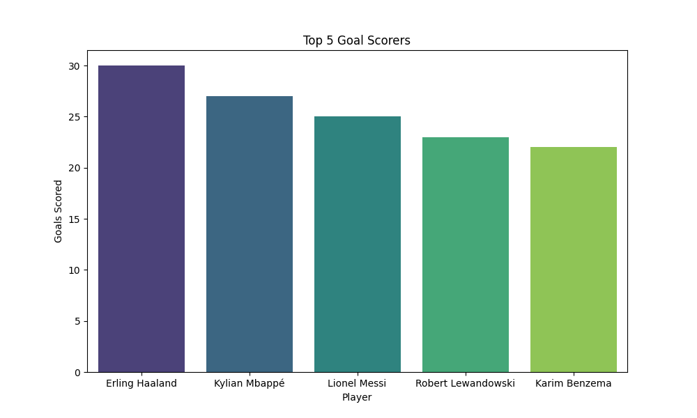
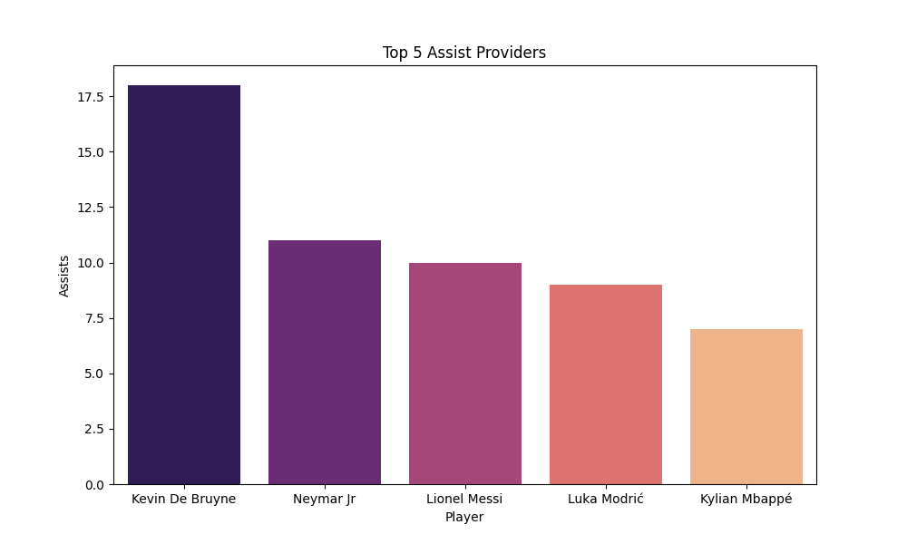
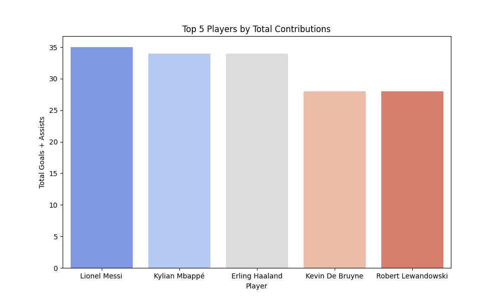

# Analyse des Performances de Joueurs de Football

Ce projet analyse les statistiques des joueurs de football sur une saison complète.  
L’objectif est d’identifier les meilleurs performeurs (buteurs, passeurs, temps de jeu) à l’aide de Python, Pandas et des visualisations.

## Structure du projet

```

football-performance-analysis/
│
├── data/
│   └── players.csv         # Jeu de données
│
├── main.py                 # Script principal d’analyse
├── README.md               # Description du projet
└── venv/                   # Environnement virtuel

```

## Fonctionnalités

- Chargement et nettoyage des données
- Calcul des moyennes (buts, passes, minutes)
- Classements : meilleurs buteurs / passeurs
- Visualisations avec matplotlib et seaborn

## Technologies utilisées

- Python 3
- pandas
- matplotlib
- seaborn

## Exemples de visualisations

### Top Goal Scorers


### Top Assist Providers


### Top players



## Exécution

1. Cloner le repo  
2. Installer les dépendances :  
```

pip install -r requirements.txt

```
3. Lancer le script :  
```

python main.py

```

## Auteur

- [Kimia GOLBAZKHANIAN](https://github.com/KimiaGol)
- Projet personnel

---

# Football Performance Analysis

This project analyzes football player statistics over a full season.  
It aims to identify top performers (goals, assists, minutes) using Python, Pandas, and data visualizations.

## Project Structure

```

football-performance-analysis/
│
├── data/
│   └── players.csv         # Dataset with player stats
│
├── main.py                 # Main Python script
├── README.md               # Project documentation
└── venv/                   # Virtual environment

```

## Features

- Load and clean player data
- Compute averages: goals, assists, minutes played
- Rank top scorers and assist providers
- Create visualizations with matplotlib and seaborn

## Tools and Libraries

- Python 3
- pandas
- matplotlib
- seaborn

## Sample Visualizations

### Top Goal Scorers


### Top Assist Providers


### Top Players


## How to Run

1. Clone the repo  
2. Install dependencies:  
```

pip install -r requirements.txt

```
3. Run the script:  
```

python main.py

```

## Author

- [Kimia Golbazkhanian](https://github.com/KimiaGol)
- Project
```

---